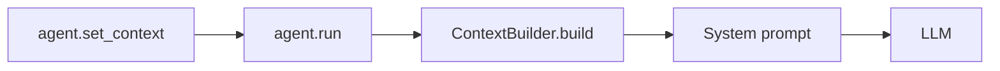

# Context Builder

The `miminions.context` module assembles an agent's **system prompt** dynamically
from on-disk workspace state, prompt templates, stored memory, and an optional
slice of cross-workspace knowledge — composed fresh before every LLM call.

```python
from miminions.context import ContextBuilder
```

!!! tip "You rarely call this directly"
    `ContextBuilder` is wired into [`Minion`](agent.md) via `set_context()`. Once
    a workspace is attached, the builder runs automatically on every `run()`.
    Direct use is mainly for inspecting or testing the generated prompt.

## Quick Start

```python
from miminions.agent import create_minion

agent = create_minion("MyAgent")

# Attach workspace context. A @agent.system_prompt callback now calls
# ContextBuilder().build(workspace, root_path) on every run().
agent.set_context(workspace, root_path="./my_workspace")

reply = await agent.run("What are the active tasks?")
```

Want to see the exact string the LLM receives? Build it yourself:

```python
from miminions.context import ContextBuilder

builder = ContextBuilder(global_top_k=5, global_db_path=None)
system_prompt = builder.build(workspace, root_path="./my_workspace")
print(system_prompt)
```

!!! warning "Constructor and `build()` take different arguments"
    The workspace and root path are passed to **`build()`**, not the
    constructor. The constructor only configures global-memory injection.

    ```python
    # Correct
    builder = ContextBuilder(global_top_k=5)
    builder.build(workspace, root_path)

    # WRONG — ContextBuilder does not take a workspace
    builder = ContextBuilder(workspace, root_path)
    builder.build()
    ```

## How It Fits In

`set_context(workspace, root_path)` stores the workspace object and root path on
the [`Minion`](agent.md). On the next `run()`, the agent rebuilds its underlying
pydantic_ai agent and registers a `@agent.system_prompt` callback that returns
`ContextBuilder().build(workspace, root_path)`. The composed context is therefore
recomputed on **every** call, so the agent always sees the latest workspace
state, memory, and prompt files.



## Emitted Sections

`build()` returns a single markdown string. The sections, in order:

| Section | Source | Notes |
|---------|--------|-------|
| `## Identity` | `workspace_obj` + clock | workspace name/id, root path, current UTC time, `data_dir` |
| `## Tool Boundary` | static | Instructs the agent to stay inside the workspace `data_dir` |
| `## Prompt Files` | `prompt/*.md` | Each bootstrap prompt file, sorted; `No prompt files found.` if empty |
| `## Global Knowledge` | global SQLite DB | **Only** emitted when `global_top_k > 0` *and* insights exist |
| `## Memory` | `memory/MEMORY.md` | Workspace-local facts (Tier 2) |
| `## Workspace Graph Summary` | `workspace_obj` | Node counts by type, top 10 rules by descending priority, sorted state keys |
| `## Skills Index` | `skills/<name>/SKILL.md` | One line per discovered skill; closes with an instruction line |

The builder reads everything tolerantly: `workspace_obj` may be a
[`Workspace`](workspaces.md), a dataclass, a plain object, or a dict — `id`,
`name`, `root_path`, `nodes`, `rules`, and `state` are all read defensively.

??? note "The closing instruction line depends on `skills_index_only`"
    `build(..., skills_index_only=True)` (the default) ends with
    *"Instruction: read a skill file before using it."* Passing `False` ends with
    *"Instruction: skills may be expanded separately before use."* The skills
    section itself always lists name → path; this flag only changes the trailing
    guidance.

## Prompt Templates

Static context lives in markdown files under `<root_path>/prompt/`, read by
`read_prompt_files`. The four **bootstrap prompt files** are:

| File | Purpose |
|------|---------|
| `AGENTS.md` | Describes the agents in the workspace |
| `USER.md` | User preferences / persona |
| `TOOLS.md` | Tool conventions and boundaries |
| `IDENTITY.md` | The agent's identity and role |

!!! note
    Only these four filenames are picked up (they are
    `BOOTSTRAP_PROMPT_FILES`). Missing files are simply omitted. Each present
    file is rendered under a `### <FILENAME>` subheading. These are scaffolded
    automatically by `init_workspace` — see [Workspaces](workspaces.md).

## Skills

Skills are discovered by `list_skills` at `<root_path>/skills/<name>/SKILL.md`.
Each directory containing a `SKILL.md` becomes one entry in the **Skills Index**,
emitted as `- <name>: <path>`. The index lists *where* skills live; the agent is
instructed to read a skill file before using it — only the index, not the full
skill bodies, is injected into the prompt.

```text
my_workspace/
├── prompt/
│   ├── AGENTS.md
│   ├── USER.md
│   ├── TOOLS.md
│   └── IDENTITY.md
├── memory/
│   └── MEMORY.md
└── skills/
    └── core/
        └── SKILL.md
```

## Global Knowledge (Tier 3)

When `global_top_k > 0`, the builder pulls recent insights from the
cross-workspace global memory database and injects them as a `## Global
Knowledge` section. This is **Tier 3** of the [three-tier memory model](memory.md).

```python
# Inject up to 5 global insights (default)
builder = ContextBuilder(global_top_k=5)

# Disable the Global Knowledge section entirely
builder = ContextBuilder(global_top_k=0)

# Point at a custom DB instead of ~/.miminions/global_memory.db
builder = ContextBuilder(global_top_k=5, global_db_path="/path/to/global.db")
```

!!! note "When the section appears"
    The `## Global Knowledge` section is emitted **only** when `global_top_k > 0`
    *and* the lookup returns at least one insight. With `global_top_k=0`, both the
    section and the SQLite lookup are skipped. Global insights are stored by the
    [`MemoryDistiller`](memory.md); reading them requires the `[sqlite]` extra
    (`pip install miminions[sqlite]`). Any error during the lookup is logged as a
    warning and swallowed — the section is omitted rather than failing the build.

The default database path is `~/.miminions/global_memory.db` (resolved via
`miminions.core.paths`, so it honors the `MIMINIONS_HOME` environment variable).

## API Reference

### `ContextBuilder`

```python
ContextBuilder(global_top_k: int = 5, global_db_path: str | None = None)
```

| Parameter | Default | Description |
|-----------|---------|-------------|
| `global_top_k` | `5` | Number of global SQLite insights to inject. `0` disables the Global Knowledge section. |
| `global_db_path` | `None` | Override path to the global memory DB. `None` → `~/.miminions/global_memory.db`. |

The constructor performs no I/O.

### `build()`

```python
build(
    workspace_obj: Any,
    root_path: str | Path,
    skills_index_only: bool = True,
) -> str
```

| Parameter | Default | Description |
|-----------|---------|-------------|
| `workspace_obj` | — | A workspace (`Workspace`, dataclass, object, or dict). Reads `id`, `name`, `root_path`, `nodes`, `rules`, `state`. |
| `root_path` | — | Workspace root; the builder reads `prompt/`, `memory/`, and `skills/` under it. |
| `skills_index_only` | `True` | Controls the trailing instruction line about skills. |

Returns the composed markdown context as a single string.

## Related

<div class="grid cards" markdown>

- :material-account-cog: **[Agent](agent.md)** — `set_context()` wires this builder into the system prompt.
- :material-folder-network: **[Workspaces](workspaces.md)** — the `workspace_obj` and on-disk `prompt/`, `memory/`, `skills/` layout.
- :material-database: **[Memory](memory.md)** — Tier 2 `MEMORY.md` and the Tier 3 global insights surfaced here.

</div>
